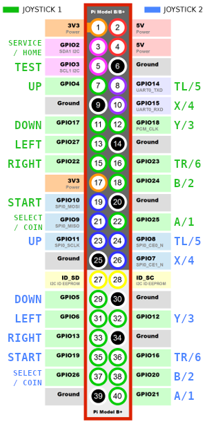

# GPIO Joystick Driver for Raspberry Pi 5

This repository contains the GPIO Joystick Driver for Raspberry Pi 5, which allows using GPIO pins to connect arcade-style joysticks with digital buttons.

## Features

* Supports 2 joysticks, each with 14 inputs:

  * 4 digital directions: Up, Down, Left, Right.
  * Up to 10 buttons:
    * P1: Start, Select/Coin, A/1, B/2, TR/6, Y/3, X/4, TL/5, Home/Service, Test
    * P2: Start, Select/Coin, A/1, B/2, TR/6, Y/3, X/4, TL/5
* High-performance 1 ms polling.
* Device Tree compilation integrated into the `Makefile` for ease of use.

## Schema




## Requirements

* Raspberry Pi 5 (RP1-based GPIO pin controller).
* Tested in Linux kernel version 6.12.
* `evtest` or `jstest` for input testing.

## Installation

### Install dependencies

```bash
sudo apt install gpiod libgpiod-dev device-tree-compiler
```

### Automatic Installation (Recommended)

Compile and install the kernel module and device tree overlay automatically:

```bash
sudo make install
```

Edit `/boot/config.txt` and add:

```bash
dtoverlay=gpio-joystick
```

Reboot to activate the changes:

```bash
sudo reboot
```

### Manual Installation

#### 1. Compile the Driver

```bash
make
```

#### 2. Insert the Module Temporarily

Manually insert the module (temporary until reboot):

```bash
sudo insmod gpio-joystick.ko
```

#### 3. Check Logs

Verify the driver is loaded and joysticks are detected:

```bash
dmesg | egrep -i 'gpio[-_]joystick|rta,gpio-joystick'
```

## Testing

### Check module information

```bash
modinfo gpio-joystick
```

### Using `evtest`

Install and run `evtest` to verify joystick events:

```bash
sudo apt install evtest
sudo evtest
```

Select the appropriate input device corresponding to your joystick.

### Using `jstest`

Install and test the joystick with `jstest`:

```bash
sudo apt install joystick
jstest /dev/input/js0
jstest /dev/input/js1
```

## Checking Pin Numbers and Status

### How to Check New Pin Numbers (kernel >= 6.6)

List GPIO pins with:

```bash
cat /sys/kernel/debug/gpio
```

### How to Check Pin Status on Pi 5

Inspect pin configuration:

```bash
sudo pinctrl
```

## Manually Setting Pull-Ups

To manually configure pull-ups for GPIO pins:

```bash
sudo pinctrl gpiochip4 4 ip pu   # Set GPIO4 as input with pull-up
sudo pinctrl gpiochip4 17 ip pu  # Set GPIO17 as input with pull-up
sudo pinctrl gpiochip4 27 ip pu  # Set GPIO27 as input with pull-up
sudo pinctrl gpiochip4 22 ip pu  # Set GPIO22 as input with pull-up
...
```

The above is just an example. Repeat this for all GPIO pins used by your joystick.

## Device Tree Overlay (permanent configuration)

The overlay `gpio-joystick.dts` is compiled automatically via the `Makefile`.

### Manual Compilation and Installation

Run the following commands to build and install the overlay manually:

```bash
make dtb
sudo cp gpio-joystick.dtbo /boot/firmware/overlays/
```

### Enable the Overlay

Edit `/boot/firmware/config.txt` and add:

```bash
dtoverlay=gpio-joystick
```

Reboot to apply changes:

```bash
sudo reboot
```

## Contributions

Contributions are welcome! Please fork the repository, make changes, and submit a pull request.

## License

This project is licensed under the GPLv2 License. See the LICENSE file for details.
